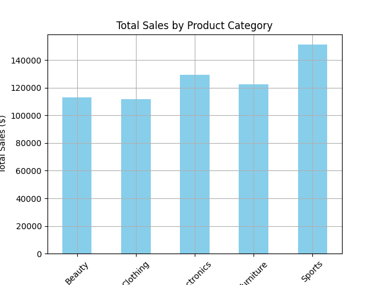
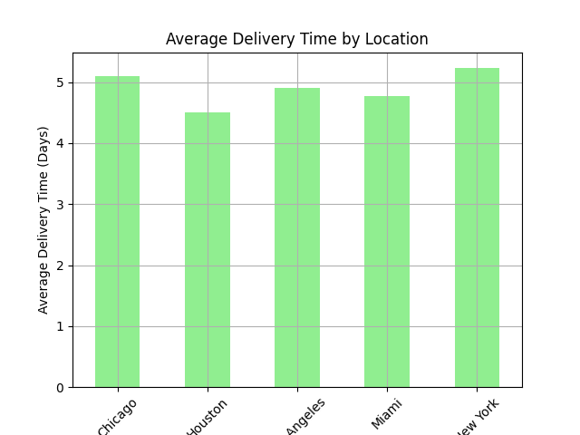
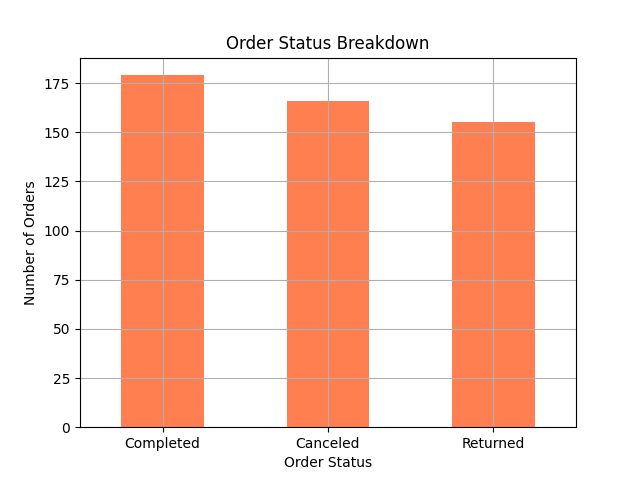

# Customer Churn Analysis for E-commerce Company

## Project Overview
This project analyzes customer churn for an e-commerce company using synthetic sales data. The goal of this project is to understand sales trends, customer behavior, and order status to gain insights into why customers leave the platform and how to minimize churn.

## Dataset
The dataset contains 500 synthetic orders with the following features:
- **OrderID**: Unique identifier for each order.
- **CustomerID**: Unique identifier for each customer.
- **ProductCategory**: The category of the product (e.g., Electronics, Clothing).
- **OrderDate**: Date when the order was placed.
- **Quantity**: Number of items in the order.
- **UnitPrice**: Price of one unit of the product.
- **TotalPrice**: Total price of the order (Quantity * UnitPrice).
- **PaymentMethod**: The method of payment (Credit Card, PayPal, etc.).
- **CustomerLocation**: The city where the customer is located.
- **DeliveryTime**: Time taken to deliver the product.
- **OrderStatus**: Status of the order (Completed, Returned, or Canceled).

## Key Insights
- **Product Category Sales**: Electronics and Clothing generated the highest sales.
- **Delivery Times**: New York had the fastest delivery times, while Miami had the longest.
- **Payment Method Preferences**: Most customers preferred Credit Card payments.
- **Order Status**: ~85% of orders were completed, while ~15% were either returned or canceled.

## Visualizations


*Figure 1: Total Sales by Product Category*



*Figure 2: Average Delivery Time by Location*


*Figure 3: Order Status Breakdown*

## Tools and Libraries Used
- **Python**
- **Pandas**: For data manipulation and analysis.
- **Matplotlib** and **Seaborn**: For visualizing data.
- **Jupyter Notebook**: For conducting analysis interactively.

## How to Run the Project
1. Clone this repository:
   ```bash
   git clone https://github.com/yourusername/Customer-Churn-Analysis.git
